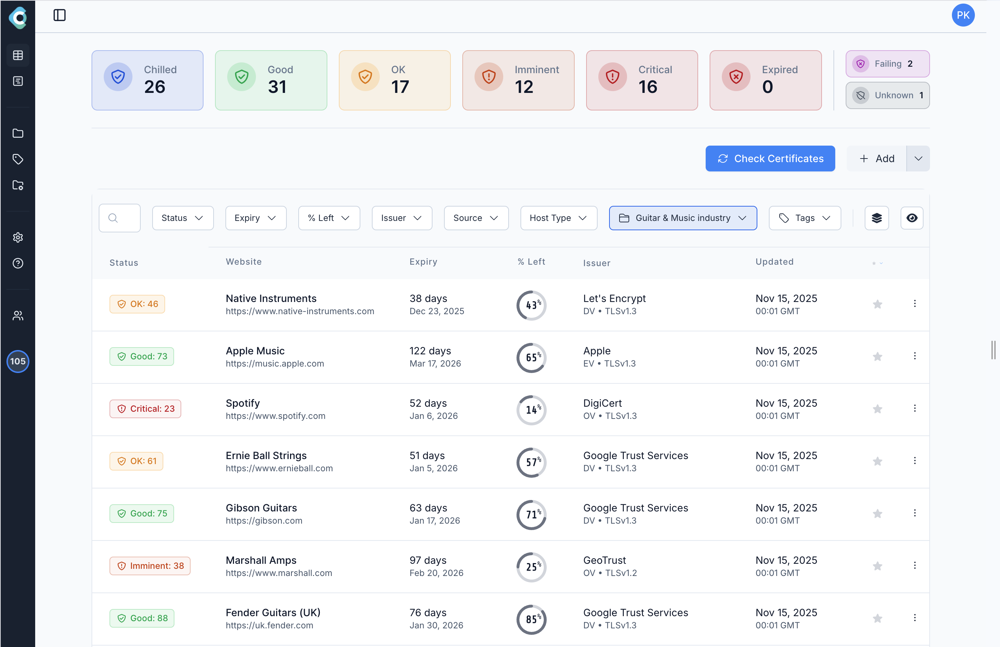

# Chill SSL

**Chill SSL** is an SSL monitoring platform for teams who need more than a calendar reminder. It helps you **monitor SSL certificates**, send **SSL expiry reminders**, and deliver **SSL notifications** when certificates renew, change state, or approach expiry — across hostnames and IPv6 endpoints that matter.

This public repository is the **changelog, releases, and issue tracker** for Chill SSL (product site: [www.chillssl.com](https://www.chillssl.com)). Application source code is private.

Built by [Peter Knight Digital](https://www.peterknight.digital).

  <a href="https://www.chillssl.com/">
    <picture>
      <source media="(prefers-color-scheme: dark)" srcset="./docs/images/chillssl-dashboard-music-dark.png" />
      
    </picture>
  </a>

<em>Chill SSL — SSL monitor, expiry reminders, and certificate notifications</em>

---

## Product & resources

| | |
|---|---|
| **SSL monitor / product** | [www.chillssl.com](https://www.chillssl.com) — SSL monitoring, verification, and certificate visibility |
| **App (dashboard)** | [app.chillssl.com](https://app.chillssl.com) |
| **SSL reminders & notifications** | [Smart SSL email notifications](https://www.chillssl.com/) — expiry reminders, status-change alerts, digest summaries |
| **SSL Guides** | [www.chillssl.com/guides](https://www.chillssl.com/guides/) — practical SSL/TLS troubleshooting guides |
| **SSL Glossary** | [www.chillssl.com/ssl-glossary](https://www.chillssl.com/ssl-glossary/) — plain-language SSL certificate definitions |
| **Blog** | [www.chillssl.com/blog](https://www.chillssl.com/blog/) — product updates and SSL monitoring articles |
| **Built by** | [Peter Knight Digital](https://www.peterknight.digital) |

Chill SSL is built for modern certificate lifecycles — including short-lived certificates — where classic “SSL reminder” tools often stop too early. Use it as your SSL monitor when renewals are automated and you still need proof that certificates are healthy.

---

## What's new

<!-- latest-release:start -->
### Latest release: [v1.0.1](https://github.com/PeterKnightDigital/ChillSSL-Issues/releases/tag/v1.0.1)

- Post-signup auto-login no longer keeps a previously logged-in session — new customers land on the correct account after email verification and password setup.
- Expiry threshold eligibility counts now update immediately after adding or editing a custom threshold — no page reload required.
- Certificate scan results for IPv6 addresses are accepted correctly.
- Let's Encrypt Generation Y intermediates (YE1–YE3, YR1–YR3) now correctly display as "Let's Encrypt".
- Improved IPv6 certificate monitoring on a regular schedule.

[Full changelog →](./CHANGELOG.md)
<!-- latest-release:end -->

---

## Before you submit an issue

- **Search first.** Your issue may already be reported or fixed. Check open and closed issues and the [changelog](./CHANGELOG.md).
- **One issue per report.** Don’t bundle unrelated problems.
- **No secrets.** Never paste API keys, session tokens, private keys, customer lists, or internal configuration.
- **No support tickets here.** For product questions, start at [www.chillssl.com](https://www.chillssl.com) or the [SSL Guides](https://www.chillssl.com/guides/) / [SSL Glossary](https://www.chillssl.com/ssl-glossary/).

---

## Reporting a bug

Include:

1. **Roughly when it happened** (date/time and timezone help).
2. **What you were doing** (e.g. adding a certificate, editing an SSL reminder threshold, viewing the SSL monitor dashboard).
3. **Expected behaviour** vs **actual behaviour**.
4. **Hostname type** if relevant (IPv4 / IPv6 / hostname) — you do **not** need to share customer domains if that is sensitive; a redacted example is fine.
5. Screenshots when they clarify the UI issue.

Please do **not** include:

- Auth tokens, cookies, or password reset links
- Full certificate PEMs / private keys
- Internal infrastructure details you may have inferred
- Other customers’ data

---

## Requesting a feature

Describe the problem you’re trying to solve with Chill SSL (monitoring, reminders, notifications, reporting, etc.). Proposed solutions are welcome but optional.

---

## Issue labels

| Label | Meaning |
|---|---|
| `bug` | Something isn’t working correctly |
| `enhancement` | Improvement or new capability |
| `documentation` | Docs / changelog clarification |
| `question` | Clarification (may be closed with a pointer to docs) |
| `needs-info` | Waiting on details from the reporter |
| `confirmed` | Reproduced by maintainers |
| `wontfix` | Tracked but not planned |

---

## Security

If you believe you’ve found a security issue, **do not open a public issue**. See [SECURITY.md](./SECURITY.md).

---

## About this repository

Chill SSL is a commercial SSL monitoring product. This repository does **not** contain application source code. It exists so customers can follow releases, report bugs, and suggest improvements.

- Product: [Chill SSL](https://www.chillssl.com)
- App: [app.chillssl.com](https://app.chillssl.com)
- Built by [Peter Knight Digital](https://www.peterknight.digital)
